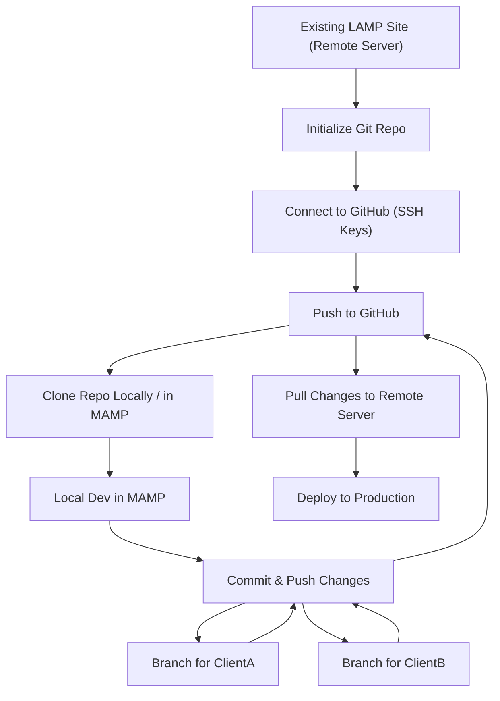

# LAMP Stack Modernization with MAMP

## Rapid Git & Modern Workflow Learning Plan - LAMP Stack with MAMP

**Audience:**
Developers with an existing LAMP site, not yet using Git, working over VS Code SSH remote, and needing to modernize their workflow with local development (using MAMP), version control, and branching.

---

## Module 1: Why Version Control? (And Why Now)

- **What you gain:**
  Safer changes, easy rollbacks, collaboration, and a clear history.
- **Agent prompt:**
  "Explain why I should use Git for my website and what problems it will solve for me."

---

## Module 2: Setting Up Git for Your Existing Site

- **Initialize Git in your project directory (remote or local):**
  - `git init`
- **Add your files and make your first commit:**
  - `git add .`
  - `git commit -m "Initial commit of existing site"`
- **Agent prompt:**
  "Guide me through initializing Git for my existing site and making my first commit."

---

## Module 3: Connecting to GitHub (and SSH Key Management)

- **Generate an SSH key (if needed):**
  - `ssh-keygen -t ed25519 -C "your_email@example.com"`
- **Add your SSH key to GitHub.**
- **Troubleshoot SSH agent and VS Code SSH remote issues.**
- **Agent prompt:**
  "Help me set up SSH keys so I can push to GitHub from my VS Code SSH remote session without conflicts."

---

## Module 4: Local Development with MAMP

- **Why use MAMP?**
  MAMP provides a simple, local LAMP stack (Apache, MySQL, PHP) for Mac users, making it easy to run and test your site locally without containers.
- **Agent prompt:**
  "Help me set up MAMP for my LAMP stack site and configure it to work with my Git repository."
- **Tasks:**
  1. [Download and install MAMP](https://www.mamp.info/en/downloads/).
  2. Clone your GitHub repo into the MAMP `htdocs` directory (usually `/Applications/MAMP/htdocs`).
  3. Configure your site in MAMP (set up Apache host, database, etc. as needed).
  4. Test running the site locally in MAMP.
  5. Use your agent for troubleshooting (e.g., "Why is my site not loading in MAMP?").

---

## Module 5: Workflow—From Local to Remote

- **Recommended flow:**
  1. Develop and test locally in MAMP.
  2. Commit and push changes to GitHub.
  3. Pull changes to the remote server for deployment.
- **Agent prompt:**
  "Show me a safe workflow for developing locally in MAMP and deploying to my remote LAMP server using Git."

---

## Module 6: Branching for Multiple Clients

- **Create and manage branches for different clients:**
  - `git checkout -b clientA`
  - `git checkout -b clientB`
- **Agent prompt:**
  "How do I keep two versions of my site for different clients using Git branches?"

---

## Module 7: Best Practices & Troubleshooting

- **.gitignore for LAMP:**
  Exclude `vendor/`, `node_modules/`, `.env`, etc.
- **Agent prompt:**
  "What should I put in my .gitignore for a LAMP stack site?"
- **Common issues:**
  SSH key conflicts, merge conflicts, pushing/pulling from remote, MAMP port conflicts, database import/export.

---

## Resources & Deep Dives

- [Oh Shit, Git!?](https://ohshitgit.com/)
- [VS Code Remote Development Docs](https://code.visualstudio.com/docs/remote/ssh)
- [GitHub SSH Key Setup](https://docs.github.com/en/authentication/connecting-to-github-with-ssh)
- [MAMP Documentation](https://documentation.mamp.info/)

---

**Tip:**
At every step, use your agent to ask for explanations, troubleshooting, or to generate config files for you!
